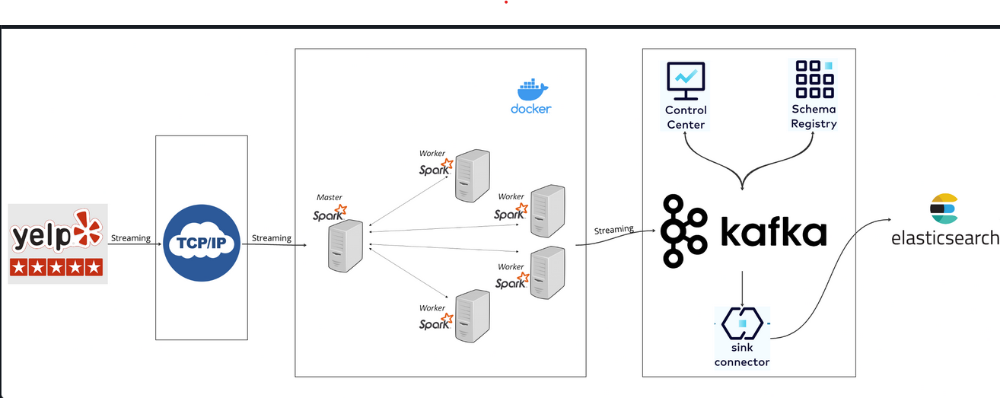

# E2EProject

## Table of Contents
## Table of Contents
- [Introduction](#introduction)
- [System Architecture](#system-architecture)
- [What You'll Learn](#what-youll-learn)
- [Technologies](#technologies)

## Introduction

This project serves as a comprehensive guide to building an end-to-end data engineering pipeline using TCP/IP Socket, Apache Spark, OpenAI LLM, Kafka and Elasticsearch. It covers each stage from data acquisition, processing, sentiment analysis with ChatGPT, production to kafka topic and connection to elasticsearch.

## System Architecture

## What You'll Learn

- Setting up data pipeline with TCP/IP 
- Real-time data streaming with Apache Kafka
- Data processing techniques with Apache Spark
- Realtime sentiment analysis with OpenAI ChatGPT
- Synchronising data from kafka to elasticsearch
- Indexing and Querying data on elasticsearch

## Technologies

- Python
- TCP/IP
- Confluent Kafka
- Apache Spark
- Docker
- Elasticsearch
